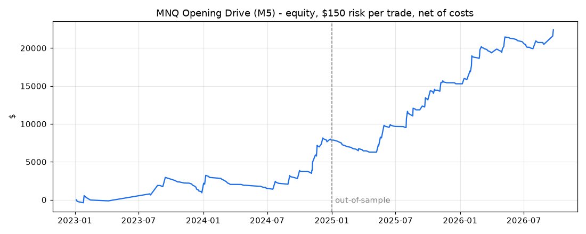

# MNQ Intraday-Strategien (TradingView + Python-Backtest)

## Version 3 (empfohlen): MNQ Opening Drive (M5)

`strategies/mnq_m5_opening_drive.pine` · Backtest: `backtest/lab/` · Ergebnisse: `backtest/results/`

### Regeln

1. **Opening Range** = erste 5-Minuten-Kerze der Kassa-Session (09:30–09:35 New York).
2. **Displacement**: Kerzenkörper |Close − Open| ≥ **10 % von ATR_D** (Ø 09:30–16:00-Range der letzten 14 Sessions).
3. **Trendfilter**: Long nur bei EMA20 > EMA50 (M5, ETH-Daten), Short nur darunter.
4. **Einstieg**: Market um 09:35 in Richtung der Kerze. Max. 1 Trade pro Tag.
5. **Stop** 0,10 × ATR_D, **Ziel 10 R**, Stop auf Einstand nach +2 R, **alles glatt um 15:55**.
6. **Größe**: fester $-Betrag Risiko pro Trade → Anzahl MNQ (Standard 150 $ = 0,3 % eines 50k-Kontos).

Bei ATR_D ≈ 400 Punkten (Sep. 2026) heißt das: Signal ab 40 Punkten Kerzenkörper, Stop 40 Punkte (80 $ pro MNQ).

### Ergebnisse (Nasdaq-100 M1, Jan. 2023 – Sep. 2026, 150 $ Risiko, 0,80 $/Seite/Kontrakt + 1 Tick Slippage)

Signale auf M5-Schlusskursen, Ausführung Minute für Minute (Stop und Ziel in derselben Minute = Stop).
Filter und Parameter wurden nur mit 2023–2024 ausgewählt, 2025–2026 ist Out-of-Sample.

| Satz | Trades | Treffer | PF | Ø R | Netto | Max. DD | Schlechtester Tag |
|---|---|---|---|---|---|---|---|
| 2023–2024 (In-Sample) | 94 | 17,0 % | 2,05 | +0,69 | +7.874 $ | 2.033 $ | −150 $ |
| **2025–2026 (Out-of-Sample)** | **129** | **21,7 %** | **2,65** | **+0,96** | **+14.523 $** | **1.589 $** | −165 $ |
| Gesamt | 223 | 19,7 % | 2,37 | +0,85 | +22.397 $ | 2.033 $ | −165 $ |

| Jahr | 2023* | 2024 | 2025 | 2026 (bis 24.09.) |
|---|---|---|---|---|
| Trades | 37 | 57 | 73 | 56 |
| PF | 1,27 | 2,69 | 2,48 | 2,86 |
| Netto | +919 $ | +6.955 $ | +7.423 $ | +7.100 $ |

\* 2023 nur 138 Handelstage (Datenlücken Feb.–Jul. verworfen). Long PF 2,04, Short PF 2,73.



### Prop-Challenge-Simulation (50k, Ziel +3.000 $)

An jedem Handelstag wird eine neue Challenge gestartet und vorwärts gespielt.

| Risiko/Trade | Topstep-ähnlich (EOD-Trailing 2.000 $, Tageslimit 1.000 $) | Apex-ähnlich (Intraday-Trailing 2.500 $) | Median Handelstage bis bestanden |
|---|---|---|---|
| 100 $ | 100 % | 100 % | 135 |
| **150 $** | **92 %** | **100 %** | **76–86** |
| 200 $ | 78 % | 85 % | 48–50 |
| 250 $ | 73 % | 75 % | 35–36 |

Die Apex-Variante rechnet mit Trade-Schlusskursen, nicht mit offenen Buchgewinnen (intraday-Trailing wird dadurch
leicht unterschätzt). Empfehlung: 150 $ Risiko. Wer schneller fertig sein will, zahlt mit deutlich höherer Durchfallquote.

### Robustheit

| Test | Ergebnis |
|---|---|
| Min. Kerzenkörper 5 / 7,5 / 10 / 12,5 / 15 / 20 % ATR_D | PF (IS/OOS) 1,64/2,05 · 2,20/2,23 · 2,05/2,65 · 2,02/2,50 · 2,04/2,98 · 1,91/2,62 |
| Stop 0,08 … 0,13 × ATR_D | PF IS 1,82–2,05, OOS 1,67–2,65 |
| Ziel 5 / 8 / 10 / 15 / 50 R | PF OOS 2,00 / 2,37 / 2,65 / 2,32 / 2,22 |
| Trendfilter EMA 9/21 bzw. EMA200 statt 20/50 | PF OOS 2,59 bzw. 2,13 (ohne Filter 1,87) |
| Slippage 2 Ticks statt 1 | PF 2,27 |
| M3-Chart, Opening Range 6 Min. | PF 2,01 / 2,44 |
| Monte-Carlo (5.000 Ziehungen, 223 Trades) | Max. DD Median 1.883 $, 95 % 3.202 $; längste Verlustserie 22 (95 %: 29) |

**Echte MNQ1!-Kerzen** (TradingView-MCP `CME_MINI:MNQ1!` = Yahoo `MNQ=F`, Kerze für Kerze identisch geprüft), 07.08.–25.09.2026:
7 Signale, **identisch** mit dem Nasdaq-100-Proxy (Tag, Richtung, Stopgröße). MNQ +506 $ (PF 1,87), Proxy +1.452 $.
Unterschied: am 23.09. traf MNQ den Stop exakt auf den Tick, der Proxy nicht.

### Was nicht funktioniert hat (gleiche Daten, Kosten und Ausführung, ~1.300 Varianten)

| Ansatz | Bestes In-Sample | Out-of-Sample |
|---|---|---|
| ORB-Breakout 5/15/30 Min., EMA/VWAP-Filter, Stops Mitte/Gegenseite/ATR, 1–3 R | PF 1,19 | ≤ 1,19, meist < 1 |
| ORB „Double Tap“ (Limit-Retest der Range-Kante, Offset −2 … +5 Punkte) | PF 1,15 | ≤ 1,08 |
| ORB-Fakeout (Rückkehr in die Range, optional RSI) | PF 1,28 (60 Trades) | 0,86 |
| ICT Liquidity Sweep (PDH/PDL, Overnight, London, ORB) + CHoCH, Market oder 50 %-Limit | PF 1,53 (35 Trades) | 0,65 |
| … zusätzlich RSI- und AD-Divergenz als Bestätigung | PF 2,18 (33 Trades) | 0,55 |
| Break of Structure + Pullback-Limit mit Offset | PF 1,20 | ≤ 1,03 |
| Opening Drive mit Limit-Einstieg (Pullback 10–50 % in die Kerze) | PF 1,81 | 1,82 → schlechter als Market, ab 20 % Pullback ~1 |
| Opening Drive mit Scalping-Zielen 1,5–2 R | PF 0,88–1,27 | 1,19–1,47 |

Ergebnis: **Klassisches Scalping mit engen Zielen verliert auf MNQ nach Kosten.** Der Vorteil liegt in den Trendtagen,
die an der ersten Kerze erkennbar sind (in der Forschung als 5-Minuten-ORB-Momentum beschrieben, z. B. Zarattini & Aziz 2023),
und er entsteht nur, wenn die Gewinner laufen dürfen. Die Limit-Einstiege schneiden schlechter ab, weil gerade die Trades zurücklaufen, die danach scheitern.
Die AD-Linie ließ sich auf den Indexdaten nur ohne Volumen rechnen (Close-Location-Value), das ist eine Einschränkung dieses Tests.

### Einordnung (bitte lesen)

- **Trefferquote ~20 %.** 4 von 5 Trades verlieren, Serien von 20+ Verlusten sind normal. Die Strategie funktioniert nur mechanisch.
- **~5–6 Trades pro Monat.** Eine 50k-Challenge dauert bei 150 $ Risiko im Median ~4 Monate.
- **Datenbasis**: Nasdaq-100-Index (HistData, M1) als Stellvertreter für MNQ, weil TradingView/Yahoo nur ~60 Tage M5 liefern.
  Zeitstempel wurden gegen MNQ geprüft und in den Sommerzeit-Übergangswochen korrigiert (`fetch_histdata.py`).
  Minutenkorrelation zu MNQ 0,97, aber nicht tick-genau.
- **Auswahleffekt**: Aus ~1.300 getesteten Varianten ausgewählt. Die Regel beruht auf einem Effekt, der in jedem Jahr einzeln
  sichtbar ist, und die Nachbarparameter sind ebenfalls profitabel. Live-Ergebnisse werden trotzdem schwächer sein als der Backtest.
- 2023 war schwach (PF 1,27). Es kann Phasen von mehreren Monaten ohne neues Hoch geben.
- Keine Nachrichtenfilter (FOMC, CPI um 8:30 liegt vor dem Signal).
- Das Pine-Script ist nicht lokal kompiliert. Falls TradingView einen Fehler meldet, bitte die Meldung schicken.

**Nächster Schritt:** Strategy Tester auf `CME_MINI:MNQ1!` M5 (ETH), dann mindestens 4–6 Wochen Demo/Paper, dann Challenge.
Keine Anlageberatung, keine Gewinngarantie.

### Reproduzieren

```
pip install pandas numpy matplotlib
python backtest/fetch_histdata.py 2023 2026 9   # Nasdaq-100 M1 laden (~120 MB entpackt, nicht im Repo)
cd backtest/lab
python report.py        # Kennzahlen, Jahre, Prop-Simulation, Equity-Chart
python robust.py        # Parameter-Nachbarschaft, Long/Short, Slippage, M3, Monte-Carlo
python g_orb.py; python g_sweep.py; python g_bos.py; python g_more.py; python g_fc.py   # Variantenraster
```

### In TradingView laden

1. Chart `CME_MINI:MNQ1!`, **5 Minuten**, Handelszeiten „Electronic Trading Hours“ (EMAs brauchen die Overnight-Kerzen).
2. Pine Editor → `strategies/mnq_m5_opening_drive.pine` einfügen → „Zum Chart hinzufügen“.
3. Unter Einstellungen „Risiko pro Trade ($)“ an das Konto anpassen. Auf einem 3-Minuten-Chart „Opening range“ auf 6 stellen.
4. Alarm: „Alarm erstellen“ → Bedingung: diese Strategie → „alert() function calls only“. Die Meldung enthält Richtung, Stückzahl, Stop und Ziel.

---

## Frühere Versionen: NY-Open Sweep + ORB (M5)

Regelbasierte Umsetzung der Chart-Beispiele (NAS100 / MNQ rund um die New-York-Eröffnung)
als TradingView-Strategie plus lokaler Python-Backtest.

| Datei | Inhalt |
|---|---|
| `strategies/mnq_m5_sweep.pine` | Pine v6 `strategy()` für TradingView (MNQ1!, 5 Minuten) |
| `backtest/sweep_backtest.py` | Python-Nachbau der Sweep-Regeln, Bar für Bar, ohne Lookahead |
| `backtest/orb_backtest.py` | Opening-Range-Breakout-Modul |
| `backtest/combined_backtest.py` | Beide Setups zusammen, so wie das Pine-Script handelt |
| `backtest/plot_trades.py`, `backtest/charts/` | Chart-Vorschau aller Trade-Tage mit Levels, Zonen und Trade-Boxen |
| `backtest/data/mnq_{5m,15m,1h}.csv` | MNQ-Kerzen (Yahoo `MNQ=F`, stichprobenartig gegen TradingView `CME_MINI:MNQ1!` geprüft: identisch) |

## Die Regeln

Aus den Bildern abgeleitet: Liquidität über/unter einem Hoch/Tief wird zur NY-Eröffnung abgeholt,
der Preis dreht, Ziel ist die Gegenseite, Stop über/unter dem Docht, danach „BE ziehen“.

1. **Levels** (vor 09:30 New-York-Zeit): Hoch/Tief des Vortags (RTH), Overnight-Hoch/Tief (18:00–09:30),
   Asia (20:00–00:00), London (02:00–05:00). Ab 08:00 kommen bestätigte Swing-Hochs/-Tiefs dazu.
   Ein Level ist verbraucht, sobald der Preis durchläuft.
2. **Sweep**: zwischen 09:30 und 11:00 läuft eine Kerze über/unter ein unberührtes Level.
3. **Bestätigung**: innerhalb von 3 Kerzen schließt eine Kerze wieder hinter dem Level **und**
   hinter dem Tief (Short) bzw. Hoch (Long) der Sweep-Kerze.
4. **Einstieg**: Market zum Schlusskurs der Bestätigungskerze (optional: Limit im OTE-Retracement).
5. **Stop**: 2 Ticks hinter dem Sweep-Docht (min. 10, max. 150 Punkte, sonst kein Trade).
6. **Absicherung**: TP1 bei 1R schließt 50 %, Rest-Stop auf Breakeven; TP2 bei 2R.
   Alles glatt um 11:30. Max. 2 Trades pro Tag, Schluss nach 2 Verlusten.

Kosten im Test: 0,62 $ Kommission pro Kontrakt und Seite plus 1 Tick Slippage. 2 Kontrakte MNQ (2 $/Punkt).

## Version 2: Trendfilter + ORB-Modul

Getestete Ergänzungen (je mit identischen Kosten und Fill-Regeln):

| Filter / Idee | Ergebnis |
|---|---|
| VWAP (mit Trend) | kein Mehrwert im späten Testteil |
| VWAP (Rückkehr zum VWAP) | schlechter |
| EMA50 auf H1 (mit Trend) | leicht besser, späte Hälfte ~0 |
| **EMA20 > EMA50 auf M5 (mit Trend)** | **besser in beiden Hälften, bei beiden Setups** |
| Gegen den EMA-Trend (Kontrollgruppe) | Verlust, bestätigt den Filter |
| Opening Range Breakout 15/30 Min. | kein Vorteil |
| **ORB 5 Min. (erste Kerze), Stop Mitte der Range, EMA-Filter** | **PF 1,85, 3 von 4 Zeitabschnitten positiv** |

Neue Standardregeln (Pine und Python):

7. **Richtungsfilter**: Long nur bei EMA20 > EMA50 (M5), Short nur darunter.
8. **Sweep-Stop-Grenze**: max. 5 × ATR(14) statt fester 150 Punkte.
9. **ORB-Modul**: Range = 09:30–09:35-Kerze. Erste Schlusskerze außerhalb entscheidet den Tag.
   Einstieg nur mit Trendfilter, Stop 2 Ticks hinter der Range-Mitte, gleiche Ausstiege (TP1 1R 50 % + BE, TP2 2R, 11:30 flat).
10. Sweep und ORB zusammen: erstes Signal gewinnt, immer nur eine Position, max. 2 Trades pro Tag.

```
python backtest/combined_backtest.py --trades   # so wie das Pine-Script handelt
python backtest/sweep_backtest.py --tf 5m        # nur Sweep
python backtest/orb_backtest.py [--grid]         # nur ORB
```

**Kombiniert (M5, 2 MNQ, 17.07.–24.09.2026)**

| Satz | Trades | Trefferquote | PF | Ø R | Netto | Max. DD |
|---|---|---|---|---|---|---|
| In-Sample | 20 | 70,0 % | 2,39 | +0,36 | +2.962 $ | 996 $ |
| Out-of-Sample | 15 | 60,0 % | 1,21 | +0,17 | +335 $ | 591 $ |
| Gesamt | 35 | 65,7 % | 1,88 | +0,28 | +3.297 $ | 996 $ |

Netto je Viertel des Zeitraums: +1.260 / +1.482 / −484 / +849 $. Bootstrap P(Ø R > 0) = 0,94.

**Einordnung**

- Besser als Version 1, und der EMA-Filter wirkt plausibel: Gegen-den-Trend-Trades verlieren.
- **Trotzdem kein Beweis**: 35 Trades in 48 Tagen, und die Regeln wurden nach ca. 300 getesteten Varianten
  ausgewählt. Das Ergebnis ist deshalb vermutlich zu optimistisch (Auswahleffekt). Der späte Testteil ist nur leicht positiv.
- Der entscheidende nächste Schritt ist der **TradingView Strategy Tester mit Deep Backtesting über mehrere Jahre**
  (M5-Historie von MNQ1!), danach Demokonto. Erst wenn es dort über 200+ Trades hält, ist es eine Strategie.

## Version 1: Ergebnisse ohne Filter

Version 1 (nur Sweep, ohne Trendfilter, max. 150 Punkte Stop).
Die ersten 60 % der Tage dienten der Entwicklung (In-Sample), die letzten 40 % wurden erst am Ende getestet (Out-of-Sample).

| Satz | Trades | Trefferquote | Profit-Faktor | Ø R | Netto | Max. Drawdown |
|---|---|---|---|---|---|---|
| In-Sample | 13 | 53,8 % | 1,39 | +0,17 | +745 $ | 575 $ |
| Out-of-Sample | 12 | 58,3 % | 0,98 | −0,08 | −35 $ | 908 $ |
| Gesamt | 25 | 56,0 % | 1,20 | +0,05 | +709 $ | 908 $ |

Reproduzieren: `python backtest/sweep_backtest.py --tf 5m --trend none --risk-atr 0`.
M15 hatte nur 6 Trades in 48 Tagen und war statistisch wertlos. Das Ergebnis hing an einzelnen Trades
(mit max. 100 Punkten Stop: −2.221 $). Echte Scalps mit engem Stop funktionieren auf MNQ zur NY-Eröffnung nicht:
Die Stops liegen im Median bei ~90 Punkten (~180 $ pro Kontrakt).

**Nicht mit echtem Geld handeln**, bevor die Strategie über mehrere Jahre im Strategy Tester und danach mehrere
Wochen auf einem Demokonto positiv war. Keine Anlageberatung, keine Gewinngarantie.

## Darstellung im Chart

Das Pine-Script zeichnet auch rückwirkend für jeden Tag:

- **Trade-Boxen** wie das Long/Short-Positions-Werkzeug: Rot = Risiko (Einstieg bis Stop), Grün = Ziel
  (Einstieg bis TP2), gestrichelt = TP1. Am Ausstieg steht das Ergebnis in $.
- **Liquiditäts-Levels** (PDH/PDL, Overnight, Asia, London, M5-Swing-Hochs/-Tiefs) mit Namen. Sie beginnen an der
  Kerze, an der sie entstanden sind, und enden an der Kerze, die sie durchbricht (durchgezogenes Ende).
  Ein Level, das bis Tagesende hält, endet gepunktet. Ein gebrochenes Level wird danach nicht mehr gezeigt und nicht mehr gehandelt.
- **M15-Support/Resistance-Zonen**: Docht-Bereich eines bestätigten M15-Swings (3 Kerzen je Seite).
  Die Zone gilt, bis eine M5-Kerze darüber (Resistance) bzw. darunter (Support) schließt, dann endet sie dort.
  Nur zur Orientierung, die Einstiege nutzen die Zonen nicht.
- EMA 20/50 bzw. VWAP je nach gewähltem Filter.

Vorschau ohne TradingView: `python backtest/plot_trades.py` erzeugt für jeden Trade-Tag ein Bild in
`backtest/charts/` nach denselben Regeln.

## Wyckoff-Zonen (Begriff aus den Beispielbildern)

Wyckoff beschreibt, wie große Marktteilnehmer in Seitwärtsphasen Positionen aufbauen (Akkumulation) oder
abbauen (Distribution). Die Schlüsselstelle ist der **Spring** (bzw. **Upthrust** oben): Der Preis sticht kurz
unter das Tief der Range, holt die Stops ab und kehrt sofort in die Range zurück. Das ist dasselbe Muster wie der
Liquidity Sweep dieser Strategie. Eine „Wyckoff-Zone“ im Chart ist meist der Bereich um dieses Range-Tief/-Hoch,
in dem auf den Spring und die Rückkehr gewartet wird.

## In TradingView laden

1. Chart `CME_MINI:MNQ1!`, Zeitrahmen **5 Minuten**, Handelszeiten „Electronic Trading Hours“ (Overnight-Kerzen werden gebraucht).
2. Pine Editor → Inhalt von `strategies/mnq_m5_sweep.pine` einfügen → „Zum Chart hinzufügen“.
3. Strategy Tester öffnen. Kommission und Slippage sind im Script voreingestellt. Unter Eigenschaften
   ggf. „Deep Backtesting“ für längere Historie aktivieren.
4. Alarme: „Alarm erstellen“ → Bedingung: diese Strategie → „alert() function calls only“.
   Das Script meldet jeden Sweep und jeden Einstieg mit Stop, TP1 und TP2.

Alle Regeln sind über die Einstellungen änderbar (Zeiten, Levels, Bestätigung, FVG-Pflicht, OTE-Einstieg,
Stop-Grenzen, TP-Größen, Breakeven, Trendfilter, ORB an/aus). Das Pine-Script ist nicht lokal kompiliert. Falls TradingView einen
Fehler meldet, bitte die Meldung schicken. TradingViews Broker-Emulator füllt Orders innerhalb einer Kerze
etwas anders als der konservative Python-Test (dort gilt: Stop und Ziel in derselben Kerze = Stop), daher
weichen die Zahlen leicht ab.
